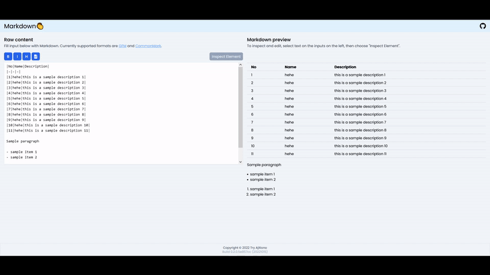

# Markdown Clap



Generally, updating Markdown is easy. We can just use our text editor or use a lot of online tools that allow Markdown previewing. However, one of the pain points that I felt when editing Markdown was when updating tables. When I need to remove a row with ordered numbers, I need to also update ALL ROWS below the deleted row. This is a chore and I think it is a room for improvement.

**Try it out**: https://imballinst.github.io/markdownclap.

## Main Features

1. Markdown preview
2. Markdown inspection, with supported elements including:
   1. Tables
3. Import CSV file into Markdown table
4. Paste cells from other source of spreadsheet as Markdown table
5. WYSIWYG-like toolbars and shortcuts (bold, italic, headings, links)

## Development

This site is built using [Astro](https://astro.build) and [SolidJS](https://www.solidjs.com). Additionally, to share states, we are using [nanostores](https://github.com/nanostores/nanostores).

### Requirements

1. Node.js® 16
2. Yarn Classic

### Starting the development server

```bash
# Install deps
yarn

# Start the development server
yarn dev
```

### Testing

```bash
yarn test
```

### Publishing

At the moment, the site is published to GitHub pages: https://imballinst.github.io/markdownclap. This is automated on every push to `main` branch.

## License

MIT
